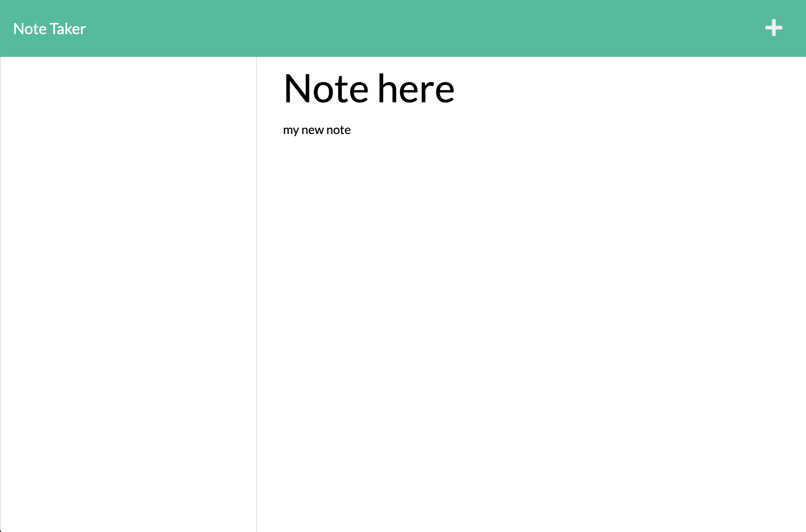

# Note Taker

An application that will save and retrieve note data using an Express.js back end from a JSON file.

## Goal:

The goal was to create a server that supports a note taking application in which you can type a note, save it and delete it.

## Issues:

- The server is not saving or pushing data from notes.

## Results:

### Github Link:

https://sbgastondesign.github.io/note-taker-2/

### Heroku Link:

https://thawing-basin-23658.herokuapp.com/

## Future Updates:

- Resolve saving and pushing issue.
- Review routes to make sure they are accurate.

### License

MIT License, Copyright (c) [2021] [StephanieGaston]

---

### Contact:

- Email: sbgastondesign@gmail.com
- Github: github.com/sbgastondesign
- LinkedIn: "http://www.linkedin.com/stephanie-gaston-1067217a/"
